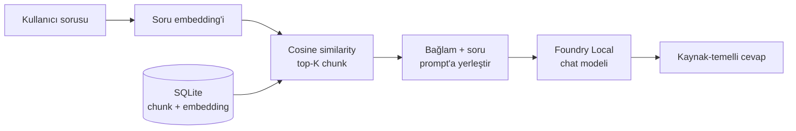

# 🎓 KampüsAsistan — Local RAG Q&A Assistant

Microsoft **Foundry Local** ile tamamen **çevrimdışı** (cihaz üzerinde) çalışan, doküman tabanlı bir soru-cevap asistanı. **KampüsAsistan**, üniversite yönetmelik ve kampüs sorularını (sınav, devam, staj, kayıt, burs, mezuniyet, kampüs hizmetleri) yerel dokümanlardan getirdiği ilgili bölümlere dayandırarak yanıtlar — böylece halüsinasyonu azaltır ve **kaynak-temelli** cevaplar üretir.

Bu proje bir Microsoft yaz stajı çalışması olarak, [Building Your First Local RAG Application with Foundry Local](https://techcommunity.microsoft.com/blog/azuredevcommunityblog/building-your-first-local-rag-application-with-foundry-local/4501968) örneğinden ilham alınarak geliştirilmiştir.

> Not: Örnek dokümanlar kurgusal bir üniversitenin yönetmeliğidir; sistem başka herhangi bir doküman koleksiyonuyla da çalışır.

## Nasıl çalışır? (RAG deseni)

**R**etrieve → **A**ugment → **G**enerate. Soru embed edilir, yerel vektör deposunda benzerlik araması yapılır, bulunan bölümler bağlam olarak yerel LLM'e verilir ve cevap bu bağlama dayandırılır.



Tüm bileşenler tek makinede, internetsiz çalışır.

## Mimari

| Katman | Sorumluluk | Dosya |
|--------|-----------|-------|
| **Data** | Chunk metinleri + embedding vektörleri (SQLite) | `src/database.py` |
| **Ingestion** | Dokümanları oku, paragraf bazlı chunk'la | `src/ingestion.py` |
| **AI** | Foundry Local embedding + chat modelleri | `src/embeddings.py`, `src/llm.py`, `src/foundry.py` |
| **Retrieval** | Query embed → cosine similarity → top-K | `src/retrieval.py` |
| **Interface** | Etkileşimli soru-cevap CLI | `src/cli.py`, `main.py` |

## Teknoloji yığını

- **Microsoft Foundry Local** (`foundry-local-sdk-winml`) — modelleri cihaz üzerinde native client ile çalıştırır
- **Embedding modeli:** `qwen3-embedding-0.6b` (retrieval)
- **Chat modeli:** `qwen3-4b` (cevap üretimi — kalite/hız dengeli; `src/config.py`'den değiştirilebilir)
- **SQLite** (Python built-in `sqlite3`) — yerel vektör deposu
- **numpy** — cosine similarity

## Ön koşullar

1. **Windows 11** ve **Python 3.11+**
2. **Microsoft Foundry Local** kurulu olmalı (Windows'ta winget ile):
   ```bash
   winget install Microsoft.FoundryLocal
   ```
   Kurulum ve doğrulama için: [Get started with Foundry Local](https://learn.microsoft.com/en-us/azure/foundry-local/get-started).

## Kurulum

```bash
# 1. Sanal ortam
py -3.11 -m venv .venv
.venv\Scripts\activate

# 2. Bağımlılıklar
pip install -r requirements.txt
```

## Kullanım

**1. Dokümanları ekle.** `.txt` / `.md` dosyalarını `data/documents/` klasörüne koy (örnek: üniversite yönetmelik dosyaları mevcut).

**2. İndeksle.** Dokümanları chunk'layıp embedding'lerini SQLite'a yazar (ilk çalıştırmada modeller indirilir):
```bash
python -m src.build_index
```

**3. Sor.** İki arayüzden biriyle:

**Web arayüzü (KampüsAsistan — önerilen):**
```bash
streamlit run streamlit_app.py
```
Tarayıcıda `http://localhost:8501` açılır. Örnek soru butonlarıyla başlayabilir, her cevabın altında kullanılan kaynakları görebilirsin. Sol menüden dokümanları yeniden indeksleyebilirsin.

**Komut satırı (CLI):**
```bash
python main.py
```
```
Soru> Zorunlu staj kaç iş günü?

Zorunlu staj, mezuniyet için toplam 40 iş günü zorunludur. (Kaynak: 06-mezuniyet.md)

  ↳ Kullanilan kaynaklar: 06-mezuniyet.md (0.71), 03-staj.md (0.66)
```
Çıkış için `cikis`, yardım için `yardim`. Doküman ekleyip/değiştirince yeniden indeksle.

## Her katmanı ayrı test etme

Katmanlar bağımsız çalışır (Foundry Local gerektirmeyenler doğrudan denenebilir):

```bash
python -m src.ingestion                          # chunking'i göster
python -m src.retrieval "sorunuz"                # top-K chunk'ları göster
python -m src.llm "sorunuz"                       # tek seferlik uçtan uca cevap
```

## Proje yapısı

```
├── main.py                 # Giriş noktası -> CLI
├── streamlit_app.py        # Web arayüzü (KampüsAsistan)
├── requirements.txt
├── .streamlit/
│   └── config.toml         # Arayüz teması
├── data/
│   ├── documents/          # Kaynak dokümanlar (.txt/.md)
│   └── rag.db              # SQLite (otomatik oluşur, git'e girmez)
└── src/
    ├── config.py           # Merkezi ayarlar (model isimleri, yollar, TOP_K)
    ├── ingestion.py        # Doküman okuma + chunking
    ├── foundry.py          # Foundry Local ortak altyapı (manager singleton)
    ├── embeddings.py       # Embedding üretimi
    ├── database.py         # SQLite schema + I/O
    ├── retrieval.py        # Cosine similarity + top-K
    ├── llm.py              # Prompt tasarımı + cevap üretimi + <think> temizleme
    └── cli.py              # Soru-cevap döngüsü
```

## Tasarım kararları

- **Halüsinasyon önleme = prompt tasarımı.** Sistem istemi modele *yalnızca verilen bağlamı* kullanmasını, cevap yoksa "bilmiyorum" demesini ve kaynak dosya adını belirtmesini dayatır (`src/llm.py`).
- **Chunking.** Paragraf bazlı; kısa parçalar (başlıklar) alt paragrafla birleştirilir, uzun parçalar cümle bazlı bölünür.
- **Brute-force retrieval.** Küçük veri kümesi için tüm vektörler belleğe okunup cosine hesaplanır — basit ve yeterli.
- **Embedding saklama.** SQLite'ta JSON metni olarak; okunabilir ve taşınabilir.
- **Native SDK.** OpenAI-uyumlu REST endpoint yerine Foundry Local'in native embedding/chat client'ları kullanılır (ek `openai` bağımlılığı yok).
- **Düşünme (reasoning) modeli desteği.** `qwen3-4b` gibi modeller cevap öncesi `<think>...</think>` bloğu üretebilir; `/no_think` talimatı ve kod tarafında temizleme ile kullanıcıya yalnızca nihai cevap gösterilir (`src/llm.py`).
- **Singleton dayanıklılığı.** `FoundryLocalManager` tek örnektir; Streamlit yeniden yükleme yaparken "zaten başlatıldı" durumu güvenle ele alınır (`src/foundry.py`).
- **Model seçimi.** Varsayılan chat modeli `qwen3-4b` (kalite/hız dengeli); `src/config.py`'den başka bir modele (ör. `phi-3.5-mini`, `qwen2.5-1.5b`) geçilebilir.

## Sınırlamalar

- Retrieval belleğe dayalı brute-force olduğundan çok büyük koleksiyonlarda (on binlerce chunk) yavaşlar — o ölçekte özel bir vektör veritabanı gerekir.
- Cevap kalitesi seçilen küçük modelle sınırlıdır; doğruluk kritikse daha büyük bir model tercih edilebilir.
- Yalnızca düz metin (`.txt`, `.md`) desteklenir; PDF/DOCX için ek bir ayrıştırma adımı gerekir.

## Kaynaklar

- [Foundry Local dokümantasyonu](https://learn.microsoft.com/en-us/azure/foundry-local/)
- [Text embeddings üretme](https://learn.microsoft.com/en-us/azure/foundry-local/how-to/how-to-generate-embeddings)
- [Native chat completions](https://learn.microsoft.com/en-us/azure/foundry-local/how-to/how-to-use-native-chat-completions)
